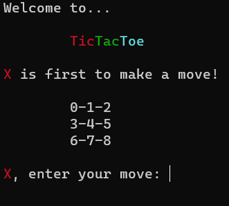
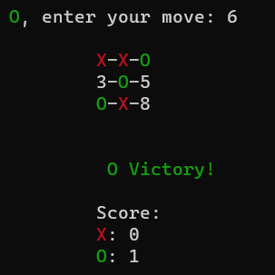
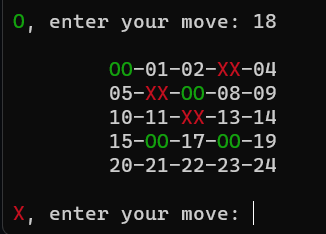
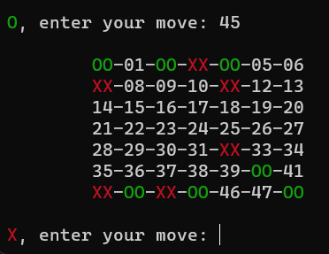
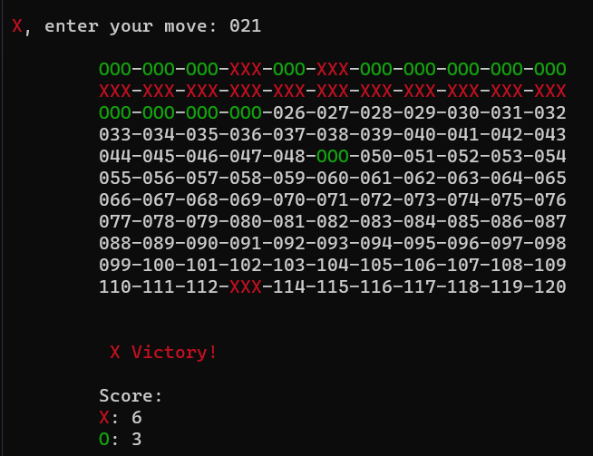

# TicTacToe with scalable board

Python implementation of the classic Tic Tac Toe game using custom TicTacToe class which supports board of any size.

## Project Structure

The project consists of the following files:

- `class_tictactoe.py`: Contains the main `TicTacToe` class which represents the Tic Tac Toe game. It handles the game logic, including checking for wins and draws, updating the game board, and displaying the game state. The key feature of this implementation is that it allows for a game board of any size. The `size` of the board can be specified when creating an instance of the `TicTacToe` class with default value being 3 (creates a classic 3x3 board), the user can also specify the `increment` varialbe - the amount by which the `size` will increase with each game cycle if the `grow` flag is set to `True`

- `class_paint.py`: Contains a simple `Paint` class which is used for coloring strings. It provides methods to paint strings in different colors, such as red, green, yellow, and cyan (more colors can be added if needed). This class uses colorama module and is utilized in the `TicTacToe` class to simplify usage and inhance readability for painting objects in the terminal.

- `main.py`: The main program file that executes the Tic Tac Toe game. It imports the `TicTacToe` and `Paint` classes, initializes the game, and handles the user input for player moves.

## Usage

1. Clone the repo.
2. Make sure you have the `colorama` module installed by running `pip install -r requirements.txt` in your terminal or command prompt.
3. Run the `main.py` file using a Python interpreter.
4. The game will prompt you to enter your moves alternately. Simply input the desired cell number to place your mark (X or O) on the board.
5. The game will display the updated board after each move, and it will check for wins or draws to determine the game outcome.

## Demo  
     
